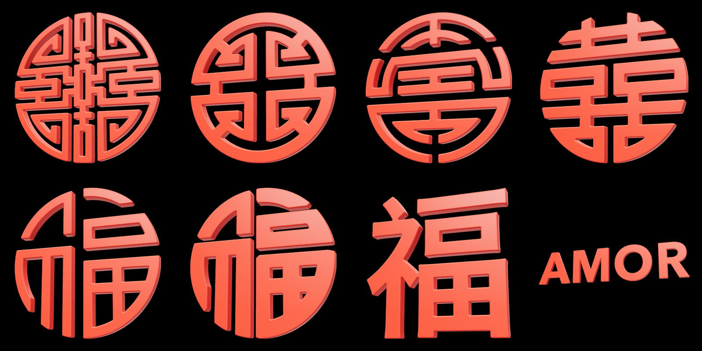

# symbols-3D

**Chinese symbols and text turned into red-lacquer 3D `.glb` assets, with exact geometry and verification against the source image.**



---

## What it does

Takes a flat image of a seal, emblem or Chinese character (or a piece of text plus a font) and produces a 3D model ready for the web, game engines or rendering:

- **Reconstruction, not tracing.** Strokes are redrawn from verticals, horizontals, arcs (each with its own fitted center) and slanted lines. Every face of that grid is filled by majority vote against the image, and a correction pass patches whatever the grid cannot explain. The result has clean edges, without the pixel staircase of the source.
- **Uniform finish.** Quarter-round bevel on front and back, rounded corners (1.3× the bevel on convex corners, 0.6× on concave ones), exact front and back normals, and a red-lacquer PBR material. Every symbol shares the same look.
- **Strict verifier.** Each model is compared with its source image before it is accepted; if it fails, it is not shipped.
- **Three versions per symbol:** detailed, light (gallery) and web (meshopt-compressed).

## Gallery

| Model | Character | Meaning | Mode | Similarity (IoU) |
|---|---|---|---|---|
| `shou-circular` | 壽 shòu | Longevity | double symmetry | 0.9785 |
| `shou-cruz` | 壽 shòu (stylized) | Longevity | `--simetria-ab` | 0.9839 |
| `shou-sello` | 壽 shòu (banded seal) | Longevity | `--simetria-lr` | 0.9756 |
| `xi-doble` | 囍 shuāng xǐ | Double happiness | `--simetria-lr` | 0.9860 |
| `fu-trazo` | 福 fú | Good fortune | `--sin-simetria` | 0.9813 |
| `fu-circular` | 福 fú (seal) | Good fortune | `--sin-simetria` | 0.9749 |
| `fu-hiragino` | 福 fú (Hiragino Sans GB font) | Good fortune | text | 0.9901 |
| `amor` | AMOR (Avenir Next) | "Love" in Spanish | text | 0.9893 |

All of them pass the verifier. Typical sizes: detailed 1–2.5 MB, light 220–630 KB, web 70–205 KB.

## Installation

Requires Python 3.12 and, for the web version, Node.js (`npx`).

```bash
git clone https://github.com/JesusGalindez/symbols-3D.git
cd symbols-3D
python3 -m venv .venv
.venv/bin/pip install -r requirements.txt
```

## Usage

### Symbol from an image

```bash
# 1. Build the model (pick the mode from the drawing's symmetry)
.venv/bin/python tools/redibujar.py fuentes/X.png X [--simetria-ab | --simetria-lr | --sin-simetria]

# 2. Verify against the image (exit code 1 on failure)
.venv/bin/python tools/verificar.py glb/X.glb fuentes/X.png --informe report.png

# 3. Light and web versions
.venv/bin/python tools/redibujar.py fuentes/X.png X [mode] --ligera
npx -y @gltf-transform/cli@4 optimize glb/X-ligera.glb glb/web/X-ligera.glb --compress meshopt --simplify false
```

Choosing the mode (IoU of the mask with its mirror image):

| Left-right | Top-bottom | Option |
|---|---|---|
| ≥ 0.97 | ≥ 0.97 | (none): double symmetry |
| < 0.95 | ≥ 0.97 | `--simetria-ab` |
| ≥ 0.97 | < 0.95 | `--simetria-lr` |
| < 0.95 | < 0.95 | `--sin-simetria` |

Works best with images of **500 px or more**, as PNG, on a flat background and without watermarks. Strokes are detected by red color or, if there is none, by dark ink.

### Text from a font

```bash
.venv/bin/python tools/letras.py "AMOR" amor --fuente "/System/Library/Fonts/Avenir Next.ttc" --indice 0
.venv/bin/python tools/letras.py "福" fu-hiragino --fuente "/System/Library/Fonts/Hiragino Sans GB.ttc" --indice 2
```

The text is centered on the origin. `--separadas` also writes one model per letter, and `--ligera` writes the gallery version. It writes `fuentes/<name>.png` with the font's exact silhouette, so text is verified just like a symbol. Use heavy weights (Bold, Demi, Heavy): with thin ones the rounding eats the stroke.

### Editor

A layer editor in the browser, Figma-style, with a live 3D preview. It opens any symbol in the gallery as editable Bézier curves, and "Generate GLB" writes the same three versions with the same finish as the command-line tools.

```bash
.venv/bin/python tools/editor.py
# open http://localhost:8792/editor.html   (?s=<name> opens that symbol or document)
```

On macOS, double-clicking `editor.command` does the same.

- **Layers.** Each layer is a closed shape with its own position, rotation and scale. Layers combine bottom to top: *unir* (add) or *restar* (subtract whatever is below). Drag them in the list to reorder.
- **Tools.** Move (V), rectangle (R), ellipse (O), pen (P) for curves, and knife (K), which cuts a symbol into separate strokes: the blue lines are suggested cuts at the stroke joints. Enter or a double click edits the nodes and handles of a layer.
- **Precision.** Smart guides snap moving layers, nodes and knife lines to edges, corners, centers and the axes; live left-right or top-bottom symmetry mirrors one half; several layers can be selected, aligned and distributed.
- **SVG in and out.** *Open → Import SVG…* brings in an outside logo (from Figma, Illustrator, Inkscape…) with its curves: paths, rectangles, circles, ellipses and polygons, with transforms, class styles and both fill rules; each filled shape becomes a layer, scaled to diameter 1. Strokes are ignored, so convert them to outlines first. *SVG* exports the design with its curves, without the rounded finish (that one belongs to the GLB).
- **Exact geometry.** The browser only draws a preview, labeled as such. The shape that counts is combined by the server with shapely, and "Generate GLB" checks it before shipping: watertight mesh, exact normals, and no stroke so thin that the rounding eats it. If a check fails, only the detailed model is written, so you can inspect it.
- **Safe by default.** Documents are saved automatically to `editor/<name>.json`, with the last 20 copies in `editor/.historial/`. Undo and redo (⌘Z, ⇧⌘Z) also bring back the selection. A GLB that did not come from the editor is never overwritten.

Press **?** in the editor for every shortcut. ⇧1 fits the visible shapes (or the selection) to the canvas; ⇧0 goes back to 100 %. The design notes, phase by phase, are in [docs/PLAN-EDITOR.md](docs/PLAN-EDITOR.md).

Tests: `.venv/bin/pytest tests/` (server) and `npm run test:ui` (full walk-through in Chrome; set `CHROME` to the browser binary outside macOS).

### Viewer

```bash
.venv/bin/python -m http.server 8791
# open http://localhost:8791/visor.html?s=shou-cruz
```

On macOS, double-clicking `ver.command` does the same. Parameters: `?s=<model>` and, optionally, `&cam=x,y,z&mira=x,y,z` to fix the camera position and target.

### Social media video

Vertical 1080×1350 video, 10 s at 30 fps, with synthesized traditional Chinese music (guzheng, xiao) and no third-party licenses:

```bash
.venv/bin/python video/musica.py                             # writes video/musica.wav
.venv/bin/python video/exportar.py fu-hiragino               # frames + MP4 (≈13 min)
.venv/bin/python video/exportar.py fu-hiragino --solo-audio  # swap only the music, in seconds
```

Requires Google Chrome. The scene lives in `video/fu-x.html`; its title card is written for 福 and must be changed for other symbols.

## The verifier

`tools/verificar.py` projects the model from the front, registers it with the image (±1 % scale and translation) and requires:

| Criterion | Threshold |
|---|---|
| Overall similarity (IoU) with the raw image | ≥ 0.97 |
| Contour: 95th percentile distance | ≤ 0.3 % of the diameter |
| Contour: maximum distance | ≤ 0.8 % of the diameter |
| Largest discrepancy region | ≤ 0.02 % of the area |
| Pieces and holes | same as the image |
| Mesh | watertight, beveled pieces, exact normals, `laca` material |

Contour and region errors are measured against the image **with the same corner rounding applied**: the finish does not count as an error, everything else does. For small images the distance tolerances rise to half a pixel (p95) and 1.5 pixels (maximum) of the source, since no model can be more precise than its source. The report marks missing areas in red and extra areas in green, numbered from worst to best.

## Project structure

```
tools/
  redibujar.py   image → exact geometry → .glb (main mode)
  letras.py      text + .ttf/.otf/.ttc font → .glb
  verificar.py   judge: .glb vs. image, PASS/FAIL per criterion
  simbolo.py     shared: mask, rounded bevel, normals, export
  editor.py      editor server: open, save, combine, cut, import/export SVG, generate
  curvas.py      dense outlines ↔ Bézier nodes (lines, arcs, cubics)
  leer_svg.py    outside SVG → editor layers with their curves
editor.html      layer editor with live 3D preview
editor/          editor documents and their history (not published)
tests/           server tests (pytest) and browser tests (Chrome)
glb/             detailed and light models · glb/web/ meshopt versions
svg/             2D outline of each model and its check mask
fuentes/         source images
video/           scene, exporter, music and sample video
visor.html       three.js viewer
docs/            README images and the editor plan
```

File, folder and flag names are in Spanish (`fuentes` = sources, `ligera` = light, `simetria` = symmetry).

## License

Code and models are released under the [MIT](LICENSE) license.

The characters 壽, 福 and 囍 are traditional public-domain symbols. The source images for `shou-sello` and `xi-doble` came from watermarked stock sites and are not included in the repository. For commercial use of those two models, regenerate them from your own or properly licensed images.
